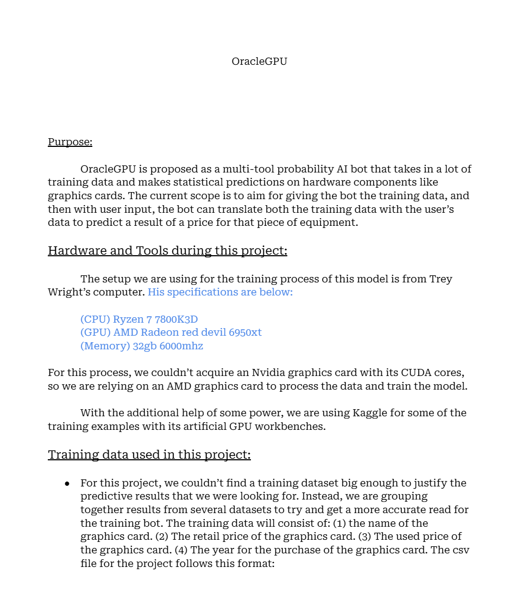
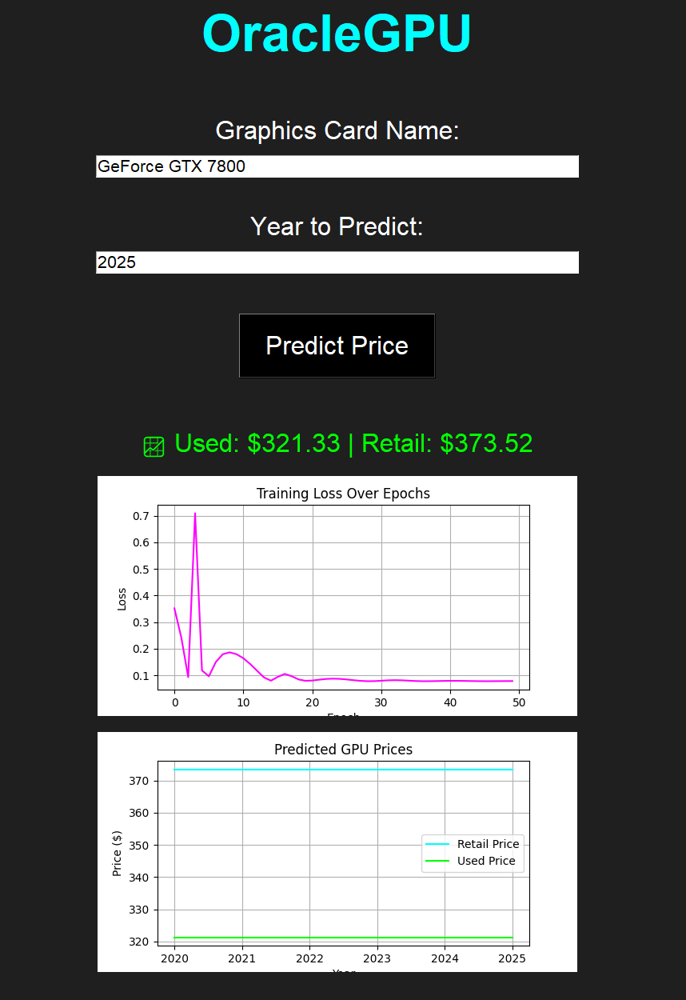

# OracleGPU – Graphics Card Price Predictor

OracleGPU is a deep learning-powered desktop application that predicts both **retail** and **used prices** of graphics cards based on historical data using an LSTM neural network.

<p align="center">
  
  
  
</p>

---

## Purpose

As GPU prices fluctuate over time—affected by hardware releases, mining booms, and supply shortages—this tool aims to model these trends using sequential data. The core objective is to **predict future prices** for specific GPU models and years using LSTM networks trained on real-world price data.

---

## Documentation

Throughout this journey, we made documentation to go further in detail of the process of creating OracleGPU. You can find this here -> https://docs.google.com/document/d/14SOWcOzCcc5ZYIKYrKVYrhSmEw9-TIirW8DFNet-h1w/edit?usp=sharing





## Model Performance

The model reaches a training loss (MSE) of approximately **0.014** after just 100 epochs, indicating it learns trends well from the normalized price data. This performance makes it suitable for general trend prediction even across unseen GPUs.

---

## UI Preview




---

## Built with the following libraries:

- [Python](https://www.python.org/)
- [PyTorch](https://pytorch.org/)
- [Tkinter](https://docs.python.org/3/library/tkinter.html)
- [matplotlib](https://matplotlib.org/)
- [scikit-learn](https://scikit-learn.org/)

---

## 🛠️ Setup Instructions

```bash
# Clone the repo
git clone https://github.com/yourusername/oracle-gpu-price-predictor.git
cd oracle-gpu-price-predictor

# Install dependencies
pip install -r requirements.txt

# Training mode

Go into training_process class and change training to true if you want to train the bot, turn it to false to turn training off. You can change the data in training.py with the data_path as well. 
# Run the GUI
python app.py
